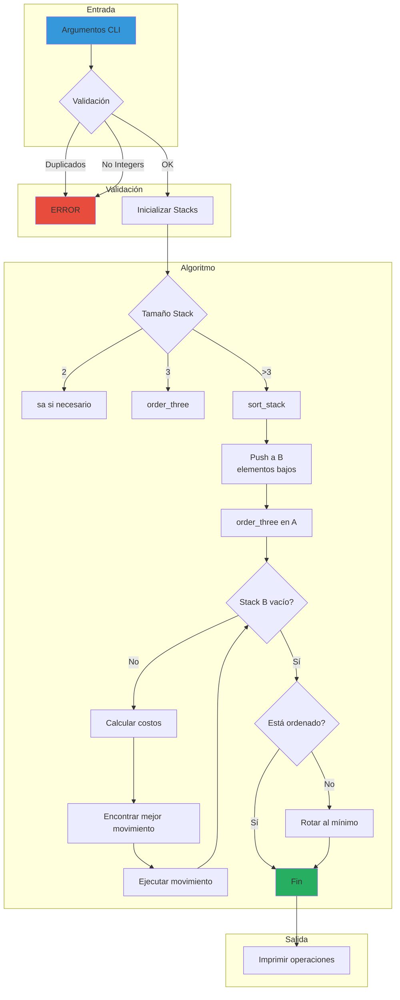

# Push Swap


> Implementación de un algoritmo de ordenamiento que utiliza dos pilas con un conjunto limitado de operaciones, optimizado para minimizar el número de movimientos.

---

## Descripción

**Push Swap** es un proyecto de algoritmos que desafía la implementación de estrategias de sorting usando dos stacks con operaciones restringidas. El objetivo principal es ordenar una secuencia de enteros en orden ascendente con el menor número posible de operaciones, aplicando pensamiento crítico para optimizar el costo computacional de cada movimiento.

---

## Características Principales

- Algoritmo de ordenamiento basado en dos stacks (A y B)
- Sistema de cálculo de costos para optimizar movimientos
- Sort de 3 elementos con máximo 3 operaciones
- Sort de 5 elementos con máximo 12 operaciones
- Sort de 100 elementos optimizado (< 700 operaciones)
- Sort de 500 elementos optimizado (< 5500 operaciones)
- Validación robusta de argumentos de entrada
- Programa bonus `checker` para verificar ordenamiento

---

## Stack Tecnológico

| Componente | Descripción |
|------------|-------------|
| **C** | Lenguaje de programación principal |
| **Make** | Sistema de build automatizado |
| **Libft** | Librería personalizada de funciones estándar |

---

## Decisiones Técnicas y Arquitectura

El proyecto implementa una estrategia de **cost-based optimization** donde cada elemento en el stack B calcula su "costo de movimiento" para llegar a su posición correcta en el stack A. La arquitectura modular separa claramente las responsabilidades:

- **Cost calculation**: Calcula el costo de mover cada elemento considerando rotaciones hacia arriba vs abajo
- **Target positioning**: Identifica la posición objetivo óptima para cada elemento del stack B
- **Move optimization**: Ejecuta movimientos combinados (rr/rrr) cuando es más eficiente

Esta aproximación permite un rendimiento O(n log n) en la mayoría de casos, evitando el brute-force que resultaría en O(n²) operaciones.



---

## Instalación y Uso

### Requisitos

- GCC compiler
- Make

### Compilación

```bash
# Clonar el repositorio
git clone https://github.com/samuelhm/push_swap.git
cd push_swap

# Compilar
make

# Compilar con bonus
make bonus
```

### Ejecución

```bash
# Ejecutar push_swap
./push_swap 4 2 7 1 5

# Verificar con checker (bonus)
./push_swap 4 2 7 1 5 | ./checker_linux 4 2 7 1 5
# salida esperada: OK
```

### Limpieza

```bash
# Limpiar objetos
make clean

# Limpiar todo (incluye binarios)
make fclean

# Recompilar
make re
```

---

## Operaciones Disponibles

| Operación | Descripción |
|-----------|-------------|
| `sa` | Swap primeros 2 elementos de A |
| `sb` | Swap primeros 2 elementos de B |
| `ss` | sa + sb simultáneo |
| `pa` | Push de B a A |
| `pb` | Push de A a B |
| `ra` | Rotate A hacia arriba |
| `rb` | Rotate B hacia arriba |
| `rr` | ra + rb simultáneo |
| `rra` | Reverse rotate A |
| `rrb` | Reverse rotate B |
| `rrr` | rra + rrb simultáneo |

---

## Estructura del Proyecto

```
push_swap/
├── src/
│   ├── push_swap.c      # Punto de entrada
│   ├── sort.c           # Lógica de ordenamiento
│   ├── new_sort.c       # Algoritmo principal
│   ├── cost.c           # Cálculo de costos
│   ├── move.c           # Ejecución de movimientos
│   ├── init_stacks.c    # Inicialización
│   ├── check_args.c     # Validación
│   ├── swaps.c          # Operaciones swap
│   ├── pushes.c         # Operaciones push
│   ├── rotates.c         # Operaciones rotate
│   ├── reverses.c        # Operaciones reverse
│   └── bonus/           # Programa checker
├── include/
│   ├── push_swap.h
│   └── bonus/
├── lib/
│   └── libft/           # Librería personalizada
├── tests/
│   └── test.sh          # Suite de tests
└── Makefile
```

---

## Habilidades Demostradas

- **Pensamiento Algorítmico**: Diseño de algoritmos de sorting optimizados
- **Gestión de Memoria**: Manipulación de estructuras dinámicas sin leaks
- **Optimización**: Minimización de operaciones mediante análisis de costos
- **Validación de Datos**: Input parsing robusto y manejo de errores
- **Modularidad**: Código organizado en componentes cohesionados

---

## Contacto

**Samuel Hurtado**

[](https://github.com/samuelhm/)
[](https://www.linkedin.com/in/shurtado-m/)

---